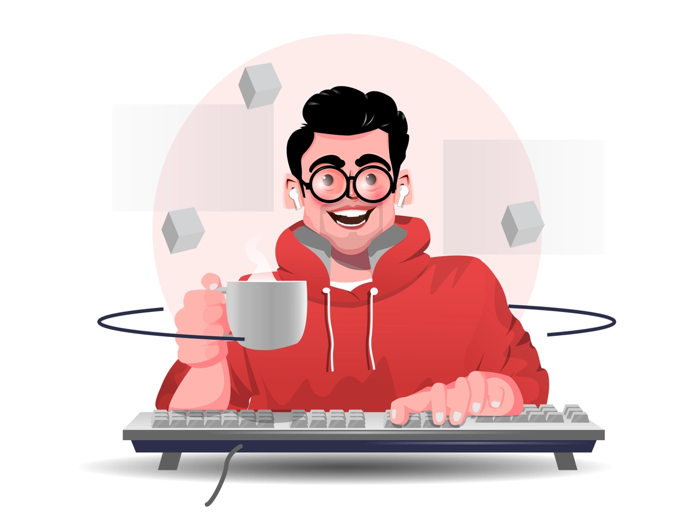

  

  

### About Me

- 🏗️ **Systems Architect & AI Engineer** — Technical Lead, Platform Architecture at **Paytm**
- 🤖 Building **production-grade AI infrastructure** — agentic workflows, RAG pipelines & MCP integrations
- 🚀 Platform serving **100M+ monthly sessions** across 8 product teams
- 👯 Open to collaborating on **Distributed Systems & AI/LLM Projects**
- 👨‍💻 All of my projects are available at [Github](https://github.com/abhayjain13)
- 💬 Ask me about **System Design, AI Orchestration & Platform Architecture**
- 📫 Reach me at **abhayjain139@gmail.com**
- ⚡ Fun fact: **Why do LLMs never feel lost?** *Attention is all they need*

 

### GitHub Stats

  
  

  
  

### Connect with Me

  

